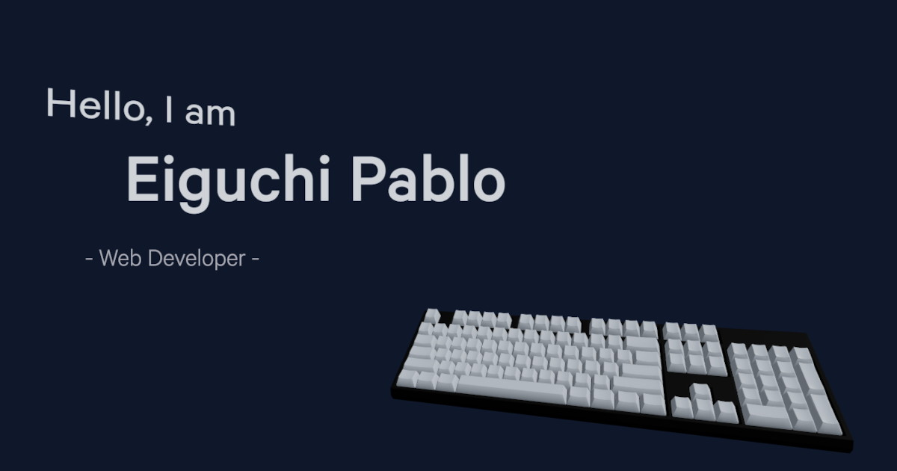

<h1 align="center">eiguchipablo.dev</h1>

#### Description:
Welcome to my interactive 3D personal portfolio built with React.js, Typescript, and Three.js.
This portfolio showcases my skills and my passion for learning new tools and technologies.

### Interactive details:
- In the hero section, the keyboard slightly faces the mouse.
- In the about section, the atom (React logo!) changes color on hover and can be drag-and-dropped.
- In the projects section, you can spin through it like a literal carousel.
- The resume section displays my resume in PDF format, generated with React PDF.
- Also you can try adding "?debug" in the url. [Try it!](https://www.eiguchipablo.dev/?debug)

#### Additional links
- [View resume](/public/EiguchiPablo.pdf).
- [Contact me in LinkedIn](https://www.linkedin.com/in/eiguchipablo/).